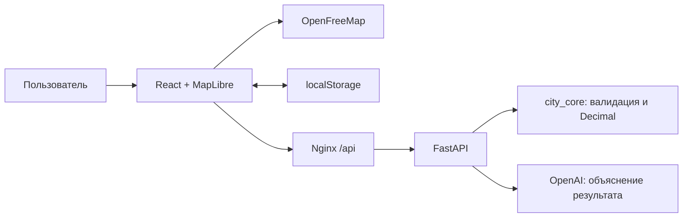

# Аким на 5 часов — Astana City Decision Lab

**Пять решений. Один бюджет. Будущее Астаны.**

Учебный AI-симулятор помогает увидеть, как распределение ограниченного городского
бюджета влияет на качество жизни районов. Пользователь выбирает инициативы,
сравнивает результат с исходным состоянием и получает объяснение последствий.
Проект предназначен для участников кейса и демонстрации жюри хакатона.

## Что реализовано

- Интерактивная карта Астаны с объёмными зданиями, переключением 2D/3D,
  вращением, масштабом и переходами к четырём городским ориентирам.
- Каталог 14 мер в пяти направлениях: транспорт, экология, социальная сфера,
  безопасность и городские сервисы.
- Выбор ровно пяти мер с бюджетом 100 и назначением района для локальных мер.
- Проверка повторов, бюджета, районов, несовместимости и лимита двух мер
  одного направления; невалидный набор не получает расчётный результат.
- Точный расчёт Astana Quality of Life Score, изменений пяти районов,
  показателей, критических значений и синергий.
- ИИ-советник: сильные стороны, риски, последствия и рекомендации.
- Сохранение до 20 именованных сценариев в браузере, повторное открытие,
  удаление и сравнение баллов в списке.

## Как работает решение

1. Пользователь открывает карту и выбирает пять инициатив с районами.
2. Клиент показывает расходы и отправляет решения в FastAPI.
3. Ядро проверяет ограничения и применяет эффекты мер с учётом лагов
   на горизонте восьми кварталов, затем добавляет синергии и ограничивает
   значения показателей диапазоном 0–100.
4. Интерфейс показывает исходное и итоговое состояние, Score и дельты.
5. По отдельной кнопке сервер передаёт каталог и готовый расчёт в OpenAI.
   Модель объясняет результат; числовой расчёт выполняется только ядром.
6. Пользователь сохраняет вариант в браузере и может сравнить его с другими.

Формула ядра: `Score = 0.7 × средневзвешенный балл районов + 0.3 × балл
слабейшего района − количество показателей ниже 40`. Арифметика использует
`Decimal`; JSON передаёт десятичные значения строками, интерфейс округляет
их только для отображения.

## Технологии

| Компонент | Технологии |
|---|---|
| Клиент | TypeScript, React 19.3, Vite 8.3, CSS Modules |
| Карта | MapLibre GL JS 6.11, OpenFreeMap, OpenStreetMap / OpenMapTiles |
| API | Python 3.12, FastAPI 0.141, Pydantic 2.13, Uvicorn, HTTPX |
| Ядро | Python: `dataclasses`, `decimal`, без runtime-зависимостей |
| ИИ | OpenAI Chat Completions, `gpt-6-sol`, `service_tier=flex`, structured outputs |
| Хранение | Versioned localStorage, без серверной БД |
| Запуск и проверки | Docker Compose, Nginx, pytest, Ruff, mypy, ESLint, TypeScript |

Полные версии зафиксированы в lock-файлах и `requirements*.txt`.
ИИ настроен на Flex без автоматического перехода на Standard.

## Архитектура



`client/` отвечает за интерфейс. `server/app/api/` — HTTP-контракт,
`server/app/agent/` — запрос к модели и проверку ответа. `core/city_core/`
содержит единственный каталог и формулы. API импортирует ядро как библиотеку;
контейнер `core` дополнительно предоставляет CLI и после расчёта завершается.
Клиент обращается к API через Nginx в одной origin. Ключ OpenAI передаётся
только серверному контейнеру, не включается в клиентскую сборку.

| Метод | Путь | Назначение |
|---|---|---|
| GET | `/api/health` | Состояние API |
| GET | `/api/catalog` | Каталог и исходный результат |
| POST | `/api/scenarios/evaluate` | Проверка и расчёт набора решений |
| POST | `/api/scenarios/analyze` | Расчёт и ИИ-объяснение |

## Установка и запуск

Нужны Git, Docker с Compose **2.20+** (используется `include`), Make и интернет
для загрузки зависимостей, карты и OpenAI. Для просмотра 3D нужен браузер с WebGL.
Node.js и Python на хосте для основного запуска не требуются.

```bash
git clone git@github.com:BAITC-Hacks/hack-22fca084-back-to-future.git
cd hack-22fca084-back-to-future
cp .env.example .env
```

Если репозиторий приватный, нужен доступ к нему. При повторном запуске
сохраните существующий `.env`. Настройки:

| Переменная | Значение примера | Назначение |
|---|---|---|
| `CLIENT_PORT` | `8040` | Локальный порт интерфейса |
| `API_PORT` | `8050` | Локальный порт API и Swagger |
| `OPENAI_API_KEY` | пусто | Необязательный ключ для ИИ-анализа |
| `OPENAI_MODEL` | `gpt-6-sol` | Модель с доступом у вашего API-проекта |

Добавьте ключ в `.env`, если нужен ИИ-анализ, и запустите:

```bash
make up
```

Откройте [приложение](http://localhost:8040) и
[документацию API](http://localhost:8050/docs).
При занятых портах измените `.env`. Сервисы публикуются на `127.0.0.1`.
Без ключа работают карта, каталог, расчёт и сохранения; анализ возвращает
явный статус `unavailable`. При ошибке провайдера расчёт сохраняется.

```bash
make ps
make logs
make down
```

`make down` останавливает контейнеры. Сохранённые сценарии остаются в браузере.
Для запуска итоговой ветки соседние клоны участников не нужны.

## Как проверить решение

### Сценарий для жюри

1. Откройте приложение и нажмите «Пример из кейса».
2. Убедитесь, что выбраны школа с детсадом, поликлиника и Safe City для Нуры,
   платформа обращений для города и чистое топливо для Сарыарки.
3. Нажмите «Рассчитать будущее города».
4. Ожидаемый результат: расходы **95**, остаток **5**, исходный Score
   **52.55768**, итоговый **56.54307**, прирост **3.98539**.
   На экране это **52,56 → 56,54**, прирост **+3,99**.
   Количество критических значений уменьшается с **2 до 0**.
5. Откройте показатели и синергии; при настроенном ключе нажмите
   «Проанализировать с ИИ» и дождитесь ответа советника.
6. Введите название, сохраните сценарий и откройте вкладку «Сценарии».
7. Для негативной проверки сбросьте решения и запустите расчёт: появится
   ошибка о необходимости выбрать ровно пять мероприятий.

Проверка HTTP без браузера:

```bash
curl -fsS http://localhost:8040/api/health
curl -fsS http://localhost:8040/api/scenarios/evaluate \
  -H 'Content-Type: application/json' \
  --data-binary @core/tests/fixtures/example_95.json
```

Проверки Python в контейнерах:

```bash
make core-check
make api-check
```

Клиентские проверки (Node.js 22.12+ на хосте):

```bash
npm --prefix client ci
npm --prefix client run typecheck
npm --prefix client run lint
npm --prefix client run test
```

После объединения прошли 68 тестов ядра и 22 теста API с Ruff/mypy;
общий Compose собрался и запустился. До объединения прошли
клиентские типы, линтер и production-сборка. В браузере проверены пример,
невалидный набор, сохранение и живой ответ ИИ. Полный многократный прогон
золотого набора ИИ не проводился; кейсы находятся в `server/evals/cases.json`.

## Данные и интеграции

- **География:** OpenStreetMap через тайлы OpenFreeMap/OpenMapTiles.
  Атрибуция сохранена на карте. Ключ картографического сервиса не требуется.
- **Расчётные данные:** синтетический набор задания — пять условных районов,
  десять показателей, четырнадцать мер, веса, лаги и ограничения в
  `core/city_core/catalog.py`. Это не актуальная статистика Астаны.
- **OpenAI:** сервер отправляет каталог и результат симуляции в
  `https://api.openai.com/v1/chat/completions`. Ключ берётся из окружения.
  Генерация не вызывается для невалидного сценария.

## Ограничения текущей версии

- Демонстрационная модель, не прогноз развития реального города.
- 3D-здания — объёмные контуры с доступными или приближёнными высотами,
  без фотореалистичных фасадов и точных моделей всех достопримечательностей.
- Границы расчётных районов не нанесены на карту; показатели показаны карточками.
- Нет регистрации, общей БД, синхронизации сценариев между устройствами
  и серверной истории. Очистка данных браузера удаляет сохранения.
- Сравнение сохранений доступно по Score и приросту в списке, без отдельного
  подробного сравнительного отчёта.
- Карта и ИИ зависят от внешних сервисов. Flex может отвечать дольше или быть
  временно недоступен; таймаут запроса к модели — 180 секунд.
- Структура ответа ИИ проверяется, но это не гарантия фактической точности
  каждой рекомендации. Полный золотой прогон и нагрузочные тесты не выполнены.
- Публичный деплой, HTTPS и промышленная эксплуатация не настроены.

## Демо и команда

Публичной deployed-версии сейчас нет. Локальное демо после `make up`:
[http://localhost:8040](http://localhost:8040).

| Участник | Часть решения | Ветка |
|---|---|---|
| Ульданов Мансур | Клиент и 3D-карта | `mansur` |
| Уралбаев Алишер | API и ИИ-советник | `alisher` |
| Далиев Досжан | Расчётное ядро | `doszhan` |

Общая сборка — `main`. Подробности расчётного контракта:
[core-contract](docs/core-contract.md), карта файлов: [CODEMAP](CODEMAP.md).
